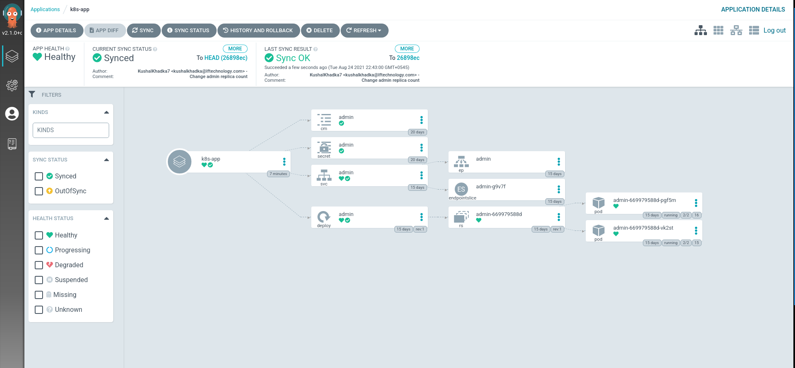

# Argo cd

## Installation

- Create namespace and deploy argo cd custom resources.

  ```
  # Create namespace.
  kubectl apply -f namespace.yml

  # Deploy argo cd custom resources.
  kubectl apply -f argo.yml
  ```

- Initially argocd server service is not exposed, so we need to use expose it as `loadbalandcer` or use `NodePort` or `port-forward`

  ```
  kubectl port-forward svc/argocd-server -n argocd 8080:443
  ```

- Get the `admin` password.
  ```
  kubectl -n argocd get secret argocd-initial-admin-secret -o jsonpath="{.data.password}" | base64 -d && echo
  ```
- Login to the argocd dashbaoard and create an app.

  ```
  cd app && kc apply -f app.yaml -n argocd
  ```

## Diagram


