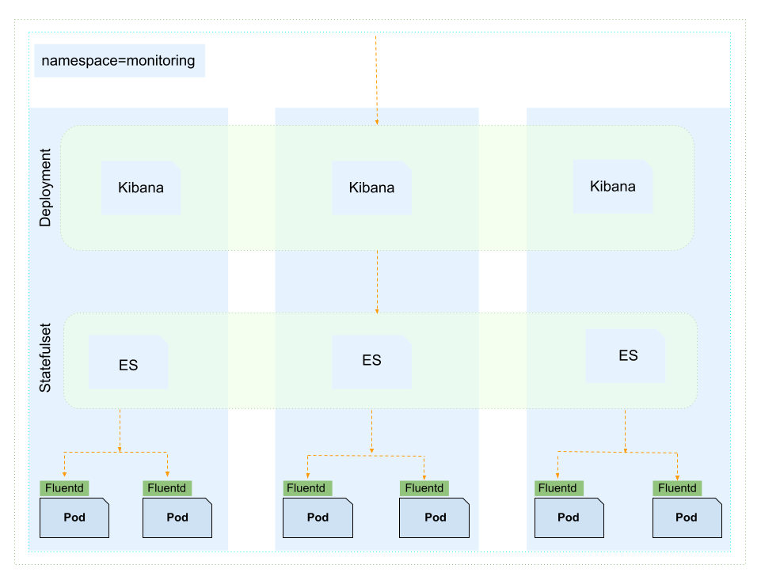

# EFK Stack

## Installation

- Create a namespace `logging`

  ```
  kubectl apply -f namespace.yml -n logging
  ```

- Deploy `fluentd` along with other reources and service accounts needed by fluentd to collect logs for pods and nodes.

  ```
  kubectl apply -f fluentD.yml -n logging
  ```

- Create `StorageClass`.
- Update the elastic search deployment as required, specially update the storage class in `volumeClaimTemplates`.
  ```
  kubectl apply -f elastic-search.yml -n logging
  ```
- Deploy `kibana`.

  ```
  kubectl apply -f kibana.yml -n logging
  ```

- Access `kibana` dashboard.
  ```
  kubectl port-forward kibana-6c9fb4b5b7-plbg2 5601:5601  --namespace=kube-logging
  ```

## Diagram


