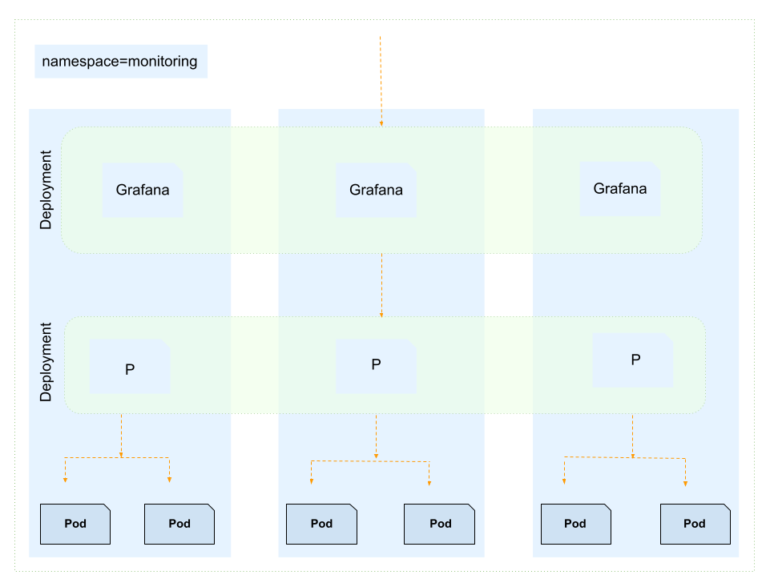

# Monitoring (Prometheus and Grafana)

- Promethous is used to colect metircs.
- Graphana is used for visualization.
- Promethous retirves the metrices, grafana grabs the metrices statics and make visualization.
- Promethous can be used standalone but graphana provides rich in visualization.
- Why promethous for visualization, because it is very dynamic enviornment and cope well with k8's.

## Installation

- Before it we need to have dynamic volume provising enabled.` PV(Persistent Volume) and PVC(Persistient Volume Claim)`, because promethous have to save the metrics logs.

- Aftet that deploy prometheus and grafana.

  ```
  # Add helm reop.

  helm repo add prometheus-community https://prometheus-community.github. io/helm-charts

  # Update helm repo.

  helm update repo
  ```

- Download the values file.

  ```
  helm inspect values prometheus-community/ kube-prometheus-stack > prometheus.yml
  ```

- Update the values as requied like port, storageClass and sevice type.

  ```
  helm install prometheus prometheus-community/ kube-prometheus-stack --namespace monitoring --values  prometheus.yml
  ```

- It will install `prometheus` and `grafana` in `monitoring` namespace.
- By default the service will not be exposed so to access the `grafana` dashboard we need to port-forward.

  ```
  kubectl port-forward deployment/prometheus-grafana 3000
  ```

- Now the grafana dashboard will be accessible on `localhost:3000`.

- Use the `username` and `password` specifeid in the values file and login to the `grafana` dashboard.
- Add data source in grafana and add grafana dashboard.
- Or prebuilt dashbaord can be obtained by searching `grafanaha` `dashboards` and using the dashboard id to import the dashboard.

## Diagram


